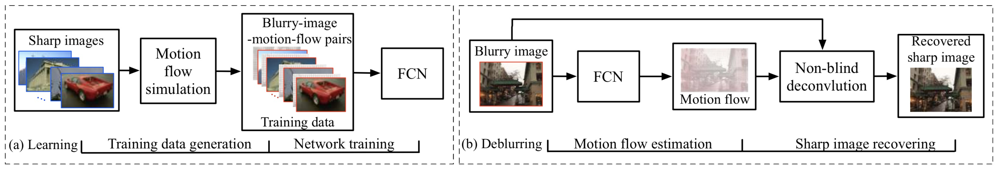
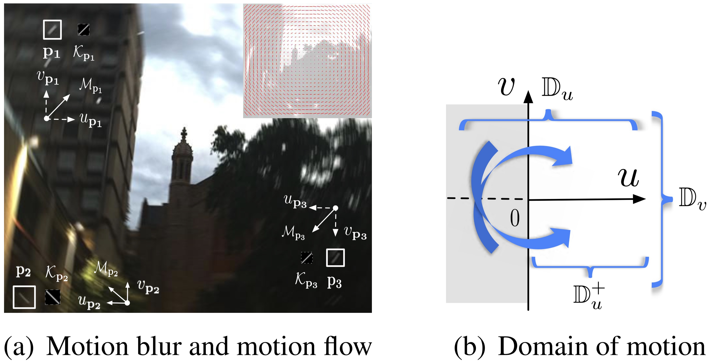
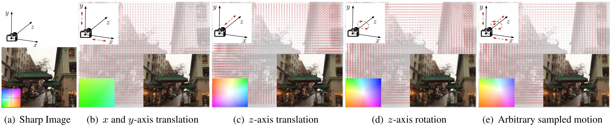

# motion-flow-syn
Motion flow and corresponding blurry image synthesis. This package is used to generate training data for the paper:

<small>*From Motion Blur to Motion Flow: a Deep Learning Solution for Removing Heterogeneous Motion Blur  
Dong Gong, Jie Yang, Lingqiao Liu, Yanning Zhang, Ian Reid, Chunhua Shen, Anton van den Hengel, Qinfeng Shi.  
In IEEE Conference on Computer Vision and Pattern Recognition (CVPR), 2017.*  
\[[Paper](http://openaccess.thecvf.com/content_cvpr_2017/papers/Gong_From_Motion_Blur_CVPR_2017_paper.pdf)\]\[[Project](https://donggong1.github.io/blur2mflow.html)\]
</small>

 

+ If you use this code for your research, please cite our paper:
````
@InProceedings{gong2017blur2mf,
author = {Gong, Dong and Yang, Jie and Liu, Lingqiao and Zhang, Yanning and Reid, Ian and Shen, Chunhua and van den Hengel, Anton and Shi, Qinfeng},
title = {From Motion Blur to Motion Flow: A Deep Learning Solution for Removing Heterogeneous Motion Blur},
booktitle = {The IEEE Conference on Computer Vision and Pattern Recognition (CVPR)},
month = {July},
year = {2017}
}
````


## Motion blur and motion vector
  
 

## Usage
+ Run `makemexfiles` in *conv_opt/*. The compiled `.mex` files are included, this step thus may be not necessary.
+ Try the example in `script_data_gen.m`. Two example for parameter setting are in the script.


## Motion flow simulation
 

+ Please refer the paper for technique details.

## Note
+ More related resources (e.g. paper and code) can be found on the [project page](https://donggong1.github.io/blur2mflow.html).
+ Partial code in *conv_opt/* is based on the implementation for paper "J. Sun, W. Cao, Z. Xu, and J. Ponce. Learning a convolutional neural network for non-uniform motion blur removal. In CVPR, 2015."
+ Partial visualization code is from [here](http://people.seas.harvard.edu/~dqsun/publication/2014/ijcv_flow_code.zip).

Update: 2 February 2018

